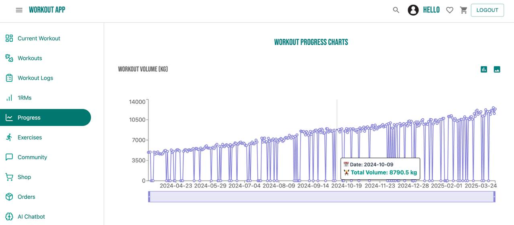
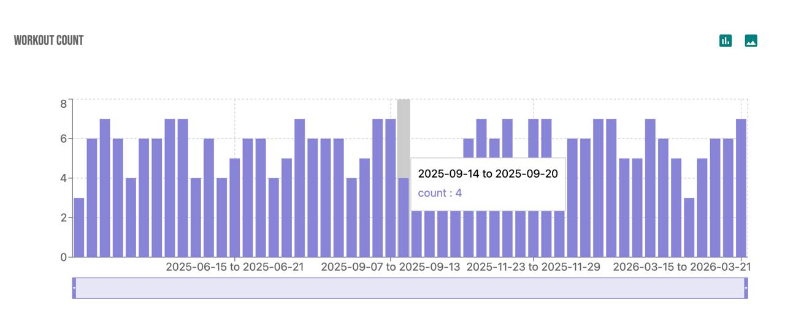
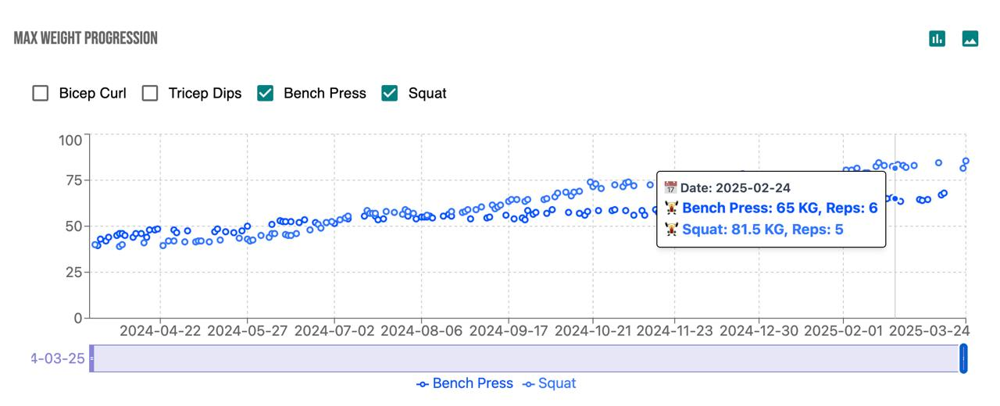
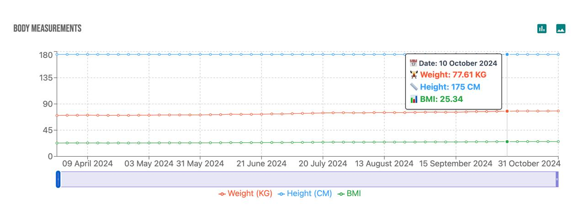
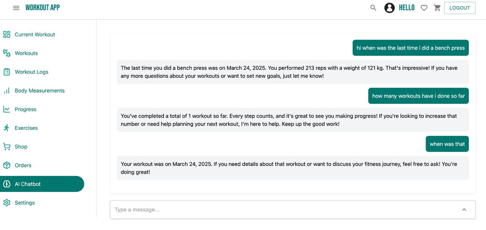

# 🏋️ Workout Tracker App

A full-stack workout tracker application that helps users log and monitor their workouts, track progress over time, manage body measurements, and visualize data insights. Built with **Java Spring Boot** on the backend and **React TypeScript** on the frontend.

## 🚀 Features

- 🔐 User authentication and registration
- 🗓️ Create and manage workouts with multiple exercises and sets
- 📝 Log completed workouts with actual reps and weights
- 📊 Track body measurements and 1RM progress over time using Recharts
- 🧮 Plate calculator for optimal weight loading
- 📈 Visual analytics for workout trends and progress
- 💬 AI chatbot for workout progress (LangChain integration)
- 🛍️ E-commerce section to purchase supplements and gear
- 💳 Stripe integration for seamless checkout
- 🧾 Workout history and detailed logs
- 🌐 Dockerized deployment (Netlify + Fly.io)

## 🛠️ Tech Stack

**Frontend:**

- React (TypeScript)
- Tailwind CSS
- Recharts
- Axios

**Backend:**

- Java 23
- Spring Boot
- MySQL
- Maven
- Spring Security
- JWT Authentication
- Stripe API
- LangChain4j + OpenAI integration

**DevOps & Tools:**

- Docker
- Netlify
- Render
- PostgreSQL (NeonDB)

## 📦 Installation

### Backend (Spring Boot)

```bash
cd backend
./mvnw spring-boot:run
```

### Frontend (React)

```bash
cd frontend
npm install
npm run dev

```

🧪 Features in Progress

- Leaderboards and workout challenges
- AI-driven recommendations based on history
- Social feed for sharing completed workouts
- Mobile Responsiveness
- Mobile App

📸 Screenshots










